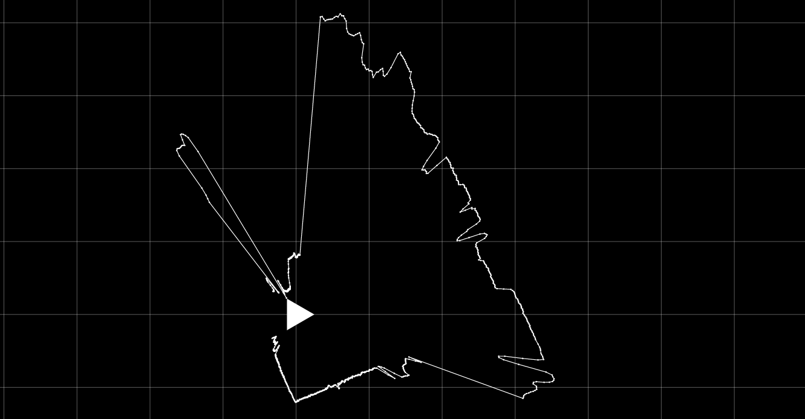

# VL.Devices.LS2Lidar (WIP)

A plugin for [vvvv](https://vvvv.org) that provides support for [SDKELI](https://www.sdkeli.com/) LS2027/LS1207DE LiDAR devices.



⚠️ **This project is currently in active development**

Tested with:
* `LS2-2027D/H03`.

### Features

**Implemented:**
* Asynchronous UDP connection with auto-recovery and background receiving loop.
* Starting the continuous distance data stream (`CMD_START_STREAM_DATA`).
* Parsing incoming raw UDP datagrams into structured scan data.
* Filtering raw LiDAR data (e.g., handling intensity overflows and distance bounding).

**Unimplemented / Unsupported (as of June 2026):**
* Stopping the data stream (`CMD_STOP_STREAM_DATA`).
* Remotely rebooting the device (`CMD_REBOOT`).
* Reading device state and health metrics (`CMD_READ_DEVICE_STATE`).
* Fetching device metadata such as Serial Number, Firmware Version, and Identify (`CMD_READ_SERIAL_NUMBER`, `CMD_READ_FIRMWARE_VERSION`, `CMD_READ_IDENTIFY`).
* Setting maintenance access mode.

*Note: The following features are currently disabled or marked as "TODO" in the official vendor C++ SDK and therefore cannot be reliably supported by this plugin at this time.*

### Behavior notice

Once invoked, the LiDAR device will stream data to the IP address that sent the start command. Because the stop command is unimplemented in the vendor SDK, the target IP and bound port will continue to receive data even after the application terminates. Currently, the only way to fully halt the data stream is to manually power cycle the device. Vendor mentions that it can properly operate 24/7. 

### Installation
```sh
# For VL
nuget install VL.Devices.LS2Lidar

#For .NET projects
nuget install antokhio.Devices.LS2Lidar
```

### Packages

* `antokhio.Devices.LS2Lidar` - `.NET Standard 2.1` common API for SDKELI LS2 LiDAR devices, to be consumed by C# projects.
* `VL.Devices.LS2Lidar` - `.NET 8` vvvv plugin for SDKELI LS2027/LS1207DE LiDAR devices.
